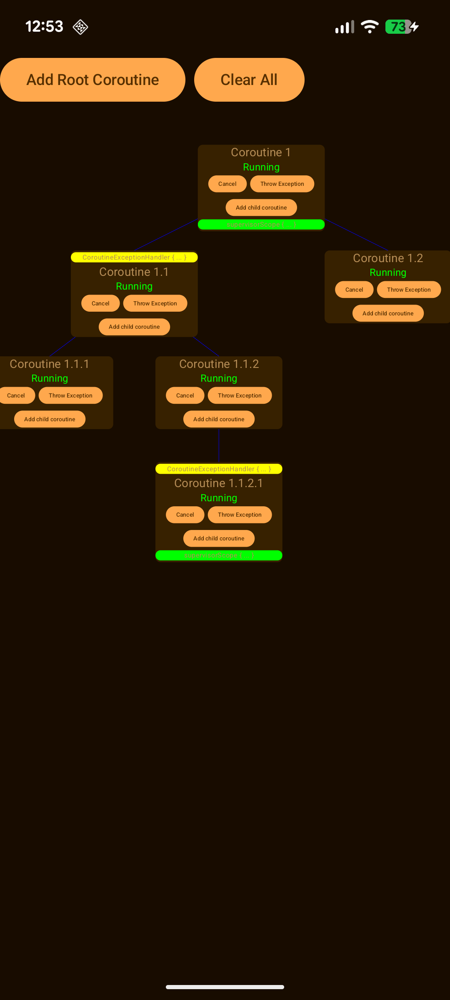
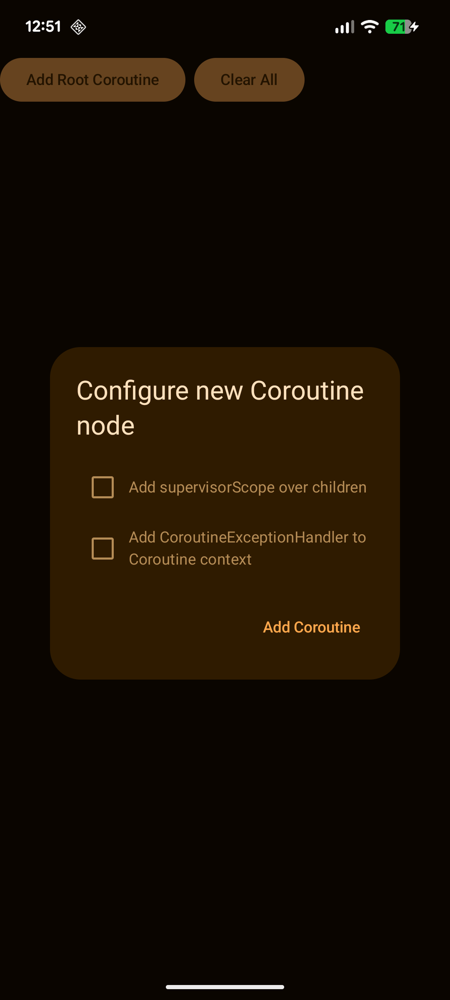
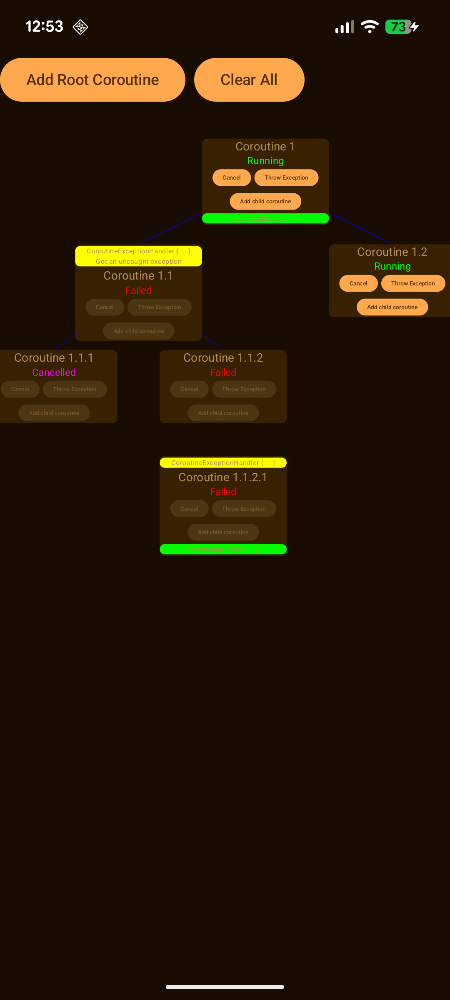

# Coroutines Visualizer

A simple Android application that visualizes Coroutines **structured concurrency** and **exceptions 
propagation/handling**.

This app was created as my final project for **Coroutines Mastery** course, led by Marcin Moskała.
Thanks a lot Marcin and kt.academy! I can recommend it to anyone who wants to deeply understand
Kotlin Coroutines.

<table>
  <tr>
    <td></td>
    <td></td>
    <td></td>
  </tr>
</table>

## Features

* Visualizes structured concurrency of coroutines as a tree
* Allows user to build any kind of coroutines structure (tree)
* Allows user to cancel any coroutine
* Allows user to throw exception in any coroutine
* Inspect the state of each coroutine at any point in time

## How to use

1. Build and launch the `CoroutinesVisualizer` app
2. Add root coroutine and child coroutines to build a structure of your choice
3. Cancel or throw exception in any coroutine and observe how other coroutines in the tree react
